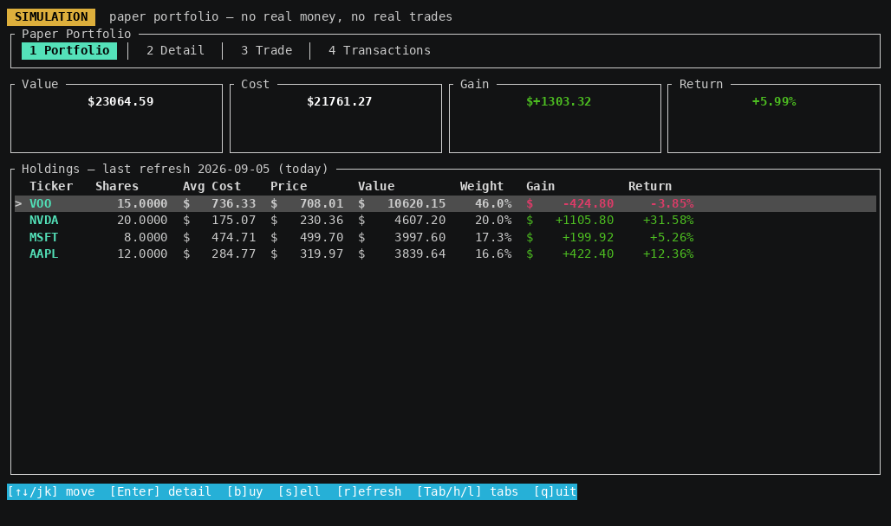

# paperticker

A simulated stock portfolio for the terminal. Pulls daily close prices from a
price data provider you choose, tracks paper buys/sells in SQLite, renders the
portfolio plus colored price / Bollinger-band charts with
[ratatui](https://ratatui.rs/).

**Simulation only.** No real trades, no real money, no investment advice.



## Architecture

A Cargo workspace with three binaries that all speak the same JSON-line
protocol over a Unix domain socket:

- **`tickerd`** — long-running daemon. Owns the SQLite database, fetches
  prices from the configured provider, listens on a Unix domain socket. Refreshes stale tickers
  at startup and once per hour (it only re-fetches when the cached
  `last_updated` isn't today — effectively daily, but resilient to suspend /
  resume and missed midnight crossings).
- **`tickerc`** — interactive terminal UI (ratatui). Connects to the daemon,
  draws the dashboard and Bollinger-band charts.
- **`tickerctl`** — scriptable CLI client. Same protocol as `tickerc`, but
  one-shot subcommands with human or `--json` output. Used by shell scripts
  and by the bundled Claude Code skill (`.claude/skills/ticker-portfolio/`).

Shared types live in `ticker-proto`; the IPC client itself is in
`ticker-client`, used by both `tickerc` and `tickerctl`.

## Requirements

Whichever way you install:

- Linux. Uses Unix domain sockets and reads `/proc`, so it is Linux-only.
- An API key for one of the supported [price data providers](#price-data-providers),
  and network access to it. The free tier is ample — see below.

**Installing from a release needs no toolchain** — the archive holds prebuilt
binaries. They are x86_64 Linux only, and link nothing beyond glibc and libgcc
(SQLite is compiled in, TLS is rustls, so there is no OpenSSL or system SQLite
to install). They are built on Ubuntu 22.04, so they need **glibc 2.35 or
newer** — Debian 12+, Ubuntu 22.04+, or equivalent.

**Rust stable (tested on 1.95)** is needed only to
[build from source](#build-from-source) — on ARM, on an older glibc, or to run
from a checkout.

## Install from a release

For x86_64 Linux machines with glibc 2.35 or newer (Debian 12+, Ubuntu 22.04+),
download the latest release archive from:

<https://github.com/figuerol/paperticker/releases/latest>

Download the `paperticker-*-linux-x86_64.tar.gz` asset from the release page.

Unpack and install the binaries on your `PATH`:

```sh
tar -xzf paperticker-*-linux-x86_64.tar.gz
install -d ~/.local/bin
install -m 755 paperticker-*-linux-x86_64/{tickerd,tickerc,tickerctl} ~/.local/bin/
```

Make sure `~/.local/bin` is on your `PATH`, then verify the install:

```sh
tickerctl --help
tickerc --help
```

### Upgrading

**Replace all three binaries together and restart the daemon.** They share a
wire protocol defined in `ticker-proto`, so a mixed set fails — see
[version skew](docs/troubleshooting.md#version-skew-after-an-upgrade).

From a release archive:

```sh
pkill tickerd
tar -xzf paperticker-*-linux-x86_64.tar.gz
install -m 755 paperticker-*-linux-x86_64/{tickerd,tickerc,tickerctl} ~/.local/bin/
tickerd &
```

From a checkout:

```sh
pkill tickerd
git pull && cargo build --release
install -m 755 target/release/{tickerd,tickerc,tickerctl} ~/.local/bin/
tickerd &
```

Your portfolio and your provider settings both survive an upgrade — they live
outside the binaries, under `$XDG_DATA_HOME/paperticker/` and
`$XDG_CONFIG_HOME/paperticker/`.

## Build from source

```sh
cargo build --release
```

Binaries land in `target/release/{tickerd,tickerc,tickerctl}`.

To install on your `PATH`:

```sh
install -m 755 target/release/{tickerd,tickerc,tickerctl} ~/.local/bin/
```

## Price data providers

**No provider is configured out of the box, and the daemon fetches nothing
until you choose one.** That is deliberate: `paperticker` should not reach a
third-party service you did not pick.

```sh
tickerctl provider list     # what's available
tickerctl provider set      # choose one, interactively
tickerctl provider status   # what's configured now
```

| Provider | Key | |
| -------- | --- | --- |
| [Alpha Vantage](https://www.alphavantage.co/support/#api-key) | free key | Documented daily time-series API. Free tier is rate-limited but ample, and permits the local cache. Personal, non-commercial use only. |

**Only Alpha Vantage is supported right now. Others could be added later,
depending on their terms of service.**

`paperticker` is not affiliated with, endorsed by, or sponsored by any price
data provider.

Your key is read from a hidden prompt and stored by the daemon under
`$XDG_CONFIG_HOME/paperticker/` (`0600`, in a `0700` directory). There is
deliberately no `--key` flag; to keep the key out of the project's storage
entirely, pass it in the daemon's environment instead.

> **[docs/providers.md](docs/providers.md)** has the detail: Alpha Vantage's
> unusually broad definition of "commercial" use, why a refresh is paced, and
> how to supply a key from the environment or a script.

## Run

**1. Start the daemon** in one terminal and leave it running:

```sh
cargo run -p tickerd
# or, after building:
./target/release/tickerd
```

**2. Choose a price data provider.** This is a one-time step — the daemon
fetches nothing until you do, and the setting persists across restarts:

```sh
tickerctl provider set        # interactive: pick one, enter the key
tickerctl provider status     # confirm it's ready
```

See [Price data providers](#price-data-providers) for the options, and
[docs/providers.md](docs/providers.md) for their terms and where your key is
stored. You can skip this if you only want to browse a portfolio
you've already cached, but any refresh or new ticker will report:

```
error: no price data provider is configured — run `tickerctl provider set` to choose one
```

**3. Open the TUI** in another terminal:

```sh
cargo run -p tickerc
# or:
./target/release/tickerc
```

Quit the TUI with `q` or `Ctrl-C`. Stop the daemon with `Ctrl-C` or
`pkill tickerd` — either way it removes its socket file on the way out.

Changing the provider later takes effect on the next refresh — no daemon
restart needed.

### One daemon per user

`tickerd` is a shared background service, not something each client starts.
One instance owns the database and the socket; `tickerc` and `tickerctl` find
it on their own. Starting a second one refuses rather than competing for the
ledger — [what to do about that](docs/troubleshooting.md#another-tickerd-is-already-running),
along with the crashed-daemon case, is in the troubleshooting guide.

For scripting or one-shot queries without launching the TUI, use `tickerctl`:

```sh
tickerctl ping
tickerctl provider status
tickerctl summary
tickerctl summary --json | jq .total_value
tickerctl buy AAPL 10               # fill at the last cached close
tickerctl buy AAPL 10 --price 150   # explicit fill price
tickerctl sell AAPL 5
tickerctl history AAPL
tickerctl history AAPL --json
tickerctl transactions
tickerctl refresh
tickerctl provider list             # available price data providers
tickerctl provider set alphavantage # choose one (prompts for the key, hidden)
tickerctl provider clear            # forget it, erase the stored key
tickerctl --help                    # full surface
```

A buy or sell with no `--price` fills at the cached close, which is the last
daily bar the provider returned — not necessarily *today's*. The daemon only
re-fetches a ticker whose snapshot isn't stamped with today's UTC date, and
that date rolls over the evening before the US session, so a trade placed
mid-session usually fills at the previous session's close. Run `tickerctl
refresh --force` first if you want the freshest price the provider will give
you (one request per holding, against your provider's daily cap).

Exit codes: `0` = success, `1` = daemon returned an error (e.g. oversell —
message on stderr), `2` = the command never reached the daemon — it couldn't
connect, got an unexpected response, or you cancelled an interactive prompt
such as `provider set`.

## Keybindings

### Global (every tab)

| Key                         | Action                                          |
| --------------------------- | ----------------------------------------------- |
| `1` `2` `3` `4`             | Jump to Portfolio / Detail / Trade / Transactions |
| `Tab` / `Shift-Tab`         | Cycle tabs forward / back                       |
| `h` `l` `←` `→`             | Cycle tabs (vim-style)                          |
| `r`                         | Refresh holdings that don't have today's close  |
| `R` (Shift-R)               | Force re-fetch of *every* holding               |
| `b`                         | Open the Trade tab in BUY mode                  |
| `s`                         | Open the Trade tab in SELL mode                 |
| `Esc`                       | Clear the status line                           |
| `q` / `Ctrl-C` / `Ctrl-Q`   | Quit                                            |

`r` skips anything already stamped with today's UTC date, so pressing it
repeatedly costs nothing once the day's prices are in. `R` ignores that check
and spends one provider request per holding every time — it's the deliberately
harder key. Both re-read the provider config first, so if you've just run
`tickerctl provider set` in another terminal, `r` is the keypress that notices.

Except for `Ctrl-C` / `Ctrl-Q`, which always quit, these apply in navigation
mode only — on the Trade tab in EDIT mode the letters type into the form.

### Portfolio tab

| Key                  | Action                                       |
| -------------------- | -------------------------------------------- |
| `↑` `↓` `j` `k`      | Move row cursor                              |
| `Enter` / `d`        | Open Detail view for the selected holding    |

### Detail tab

Renders a colored Braille line chart of close price + 20-day SMA + ±2σ
Bollinger bands. Cyan is close, yellow is SMA, dark-grey lines are the bands.

| Key             | Action                                                |
| --------------- | ----------------------------------------------------- |
| `↑` `↓` `j` `k` | Cycle through holdings — the chart reloads each time |

The cursor is shared with the Portfolio tab, so moving here moves there too.

### Trade tab (modal)

The Trade tab is **modal**, vim-style. It opens in **NAV** when you land via
`3` / `Tab` / `h` / `l`, and in **EDIT** when you press `b` / `s` (explicit
intent to trade).

**NAV mode** — typing does *not* go into the form:

| Key                       | Action                                    |
| ------------------------- | ----------------------------------------- |
| `i` / `a` / `Enter`       | Enter EDIT mode for the focused field     |
| `j` `k` `↑` `↓`           | Move between Ticker / Shares / Price      |
| `h` `l` `Tab` `Shift-Tab` | Switch tabs                               |
| `Esc`                     | Back to Portfolio                         |

Every global key above still works here — `q` quits, `1`-`4` jump, `r` / `R`
refresh. Only EDIT mode swallows them.

**EDIT mode** — typing fills the focused field:

| Key                     | Action                              |
| ----------------------- | ----------------------------------- |
| `Esc`                   | Back to NAV (stays on Trade tab)    |
| `Tab` / `Shift-Tab`     | Next / previous field               |
| `Ctrl-←` / `Ctrl-→`     | Flip BUY ↔ SELL                     |
| `Enter`                 | Submit the trade                    |
| `Backspace`             | Delete a character                  |

Space is ignored, as is any `Ctrl`-modified character — neither reaches the
field buffer.

The current mode is shown in the tab title (` NAV ` blue / ` EDIT ` magenta)
and the banner under the title swaps shortcut sets accordingly.

### Transactions tab

| Key             | Action          |
| --------------- | --------------- |
| `↑` `↓` `j` `k` | Move row cursor |

## Finding tickers

Symbols are US-market tickers with a dash for share classes — e.g. `AAPL`,
`BRK-B`, `VOO`. Alpha Vantage has a symbol search endpoint if you're unsure:

```
https://www.alphavantage.co/documentation/#symbolsearch
```

Then type the symbol into the Trade form.

## Data storage

Everything lives in a single SQLite file:

```
~/.local/share/paperticker/portfolio.db
```

Honors `$XDG_DATA_HOME` if set. The IPC socket is at
`$XDG_RUNTIME_DIR/paperticker.sock`, or `/tmp/paperticker-<uid>/paperticker.sock`
as a fallback. Both the socket (`0600`) and the fallback directory (`0700`)
are owner-only — see [SECURITY.md](SECURITY.md).

Two tables:

- **`transactions`** — append-only ledger of buys (`shares > 0`) and sells
  (`shares < 0`). Holdings and cost basis are computed by replaying it.
- **`price_cache`** — one row per ticker with the current price, roughly 6
  months of daily close history as JSON, and the `last_updated` date. (Alpha
  Vantage returns ~100 sessions rather than a full 6 months; still far more
  than the 20-day Bollinger window needs.)

### Reset the database

```sh
# stop the daemon first (Ctrl-C or `pkill tickerd`)
rm ~/.local/share/paperticker/portfolio.db
# restart — tickerd recreates the schema
cargo run -p tickerd
```

## Cost basis

Sells are accounted at the running average cost; partial sells reduce shares
pro-rata. Good enough for paper trading, not good enough for tax reporting —
don't use it for that.

## Troubleshooting

> **[docs/troubleshooting.md](docs/troubleshooting.md)** is the symptom-first
> list: the daemon won't start or can't be reached, a mixed-version client and
> daemon, `no price data provider is configured`, provider errors and rate
> limits, prices that look stale after time offline, and resetting the
> database.

## Limitations

- One symbol per row; pass provider symbols verbatim.
- Dividends, splits, and corporate actions aren't modeled — the cached
  history is whatever the provider returns (adjusted close where offered).
- No multi-currency conversion.
- One daemon per user (the socket path is per-uid).

---

## Claude Code skill

A project-level skill ships in `.claude/skills/ticker-portfolio/SKILL.md`.
When you open Claude Code in this repo it auto-loads, so you can ask things
like *"what's my portfolio look like?"* or *"buy 5 AAPL at today's close"* and
Claude will drive `tickerctl` for you (with explicit confirmation before any
buy/sell). The TUI is unaffected — Claude is just another client of the same
daemon.

---

**Simulation only. Not financial advice. Don't use this to decide real trades.**
